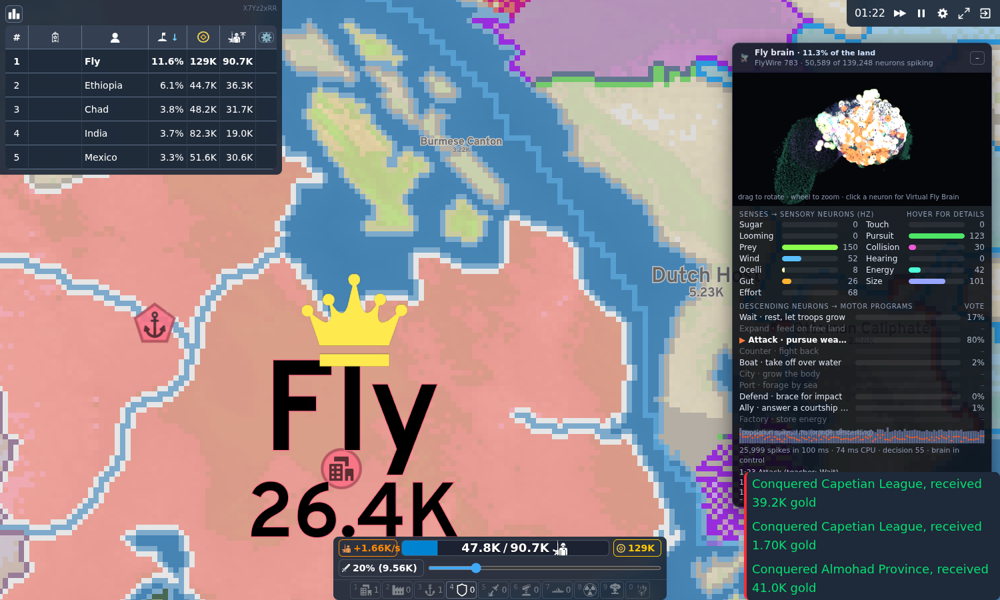
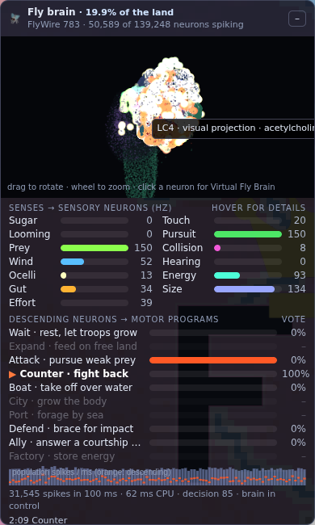

# OpenFly

A fruit fly brain plays [OpenFront](https://github.com/openfrontio/OpenFrontIO).

The brain is the adult *Drosophila* connectome from [FlyWire](https://flywire.ai/) (release 783, the dataset
[Virtual Fly Brain](https://www.virtualflybrain.org/) links to): 139,248 reconstructed neurons, of which the
50,589 outside the optic lobes run as spiking neurons with 2.15 million synaptic connections. The fly senses the
game through its taste, touch, hearing, vision and ascending body-state neurons, and it acts through its descending
neurons. You watch it play a normal singleplayer match while a panel shows its whole brain firing.



## Quick start

Requirements: Node 24 or newer, git, and a browser with WebGL2. A dedicated GPU is not needed; see
[Running on a slow machine](#running-on-a-slow-machine). OpenFront pins Node 24.x
with npm 12.x; on other versions `npm run setup` warns and installs anyway. That has been checked on Node 26 with
npm 11 (tests, build, dev server and fly games all work). If you hit a problem there, switch to Node 24
(`nvm install 24 && npm i -g npm@12`) and run setup again.

```bash
git clone --recursive https://github.com/mike-s-zaugg/OpenFly.git
cd OpenFly
npm run setup      # pins OpenFront, applies the OpenFly hooks, installs dependencies
npm run dev        # OpenFront dev server on http://localhost:9000
```

In the browser: **Solo**, pick a map and difficulty, then **🪰 Let the fly play**. The fly takes your player
slot, so the HUD, gold, troops and leaderboard are the fly's ("Fly" on the map). Your clicks are ignored in this
mode. Pause and the fast-forward button still work, which helps: a fly match takes 10 to 15 minutes at normal speed.

### Running on a slow machine

The brain costs about 35 ms of CPU per decision (one decision every 1.5 s of game time), and that work is spread
over five game ticks, so it adds roughly 7 ms to a tick instead of stalling one tick by 35 ms. It runs in the game's
web worker, off the page's main thread.

Drawing is usually the bigger cost on a laptop without a GPU. The button in the brain panel's title bar switches
the 3D view between **HQ** (all 139,248 neurons at full resolution), **Lite** (only the 50,589 simulated neurons, at
normal resolution and 30 fps) and **Off** (no 3D view; senses, votes and log keep updating). OpenFly starts in Lite
on machines with 4 or fewer CPU cores or 4 GB of memory or less, and drops from HQ to Lite by itself if the page
keeps running below 25 fps. A choice made with the button is remembered.

## What is going on in the fly's head

Every 1.5 s of game time the fly makes one decision:

1. **Senses.** The game state is reduced to 17 numbers between 0 and 1. Each drives Poisson spikes (up to 150 Hz,
   the rate used by Shiu et al.) in one identified population of real FlyWire neurons.
2. **Brain.** The connectome runs for 100 ms of simulated time as leaky integrate-and-fire neurons (Shiu et al.
   2024 constants: 20 ms membrane, 5 ms synapse, 7 mV to threshold, 0.275 mV per synapse, 1.8 ms delay). The
   100 ms are spread over five game ticks, so no single tick has to wait for the whole brain.
3. **Readout.** Spike counts of the 1,413 descending and brain motor neurons feed two linear readouts that read the
   same neurons in parallel: a military one and an economy one. Each picks one of its motor programs, and only
   programs the body can run right now compete (you cannot build a port without coast). A fly that has to choose
   between building a city and attacking tends to build forever, so the two run side by side, the way a real fly
   walks and grooms with different legs at once.
4. **Motor programs.** Both winners are carried out in the game (which tile, how many troops), the way the ventral
   nerve cord turns a descending "walk forward" command into leg movements.

| Game signal | Neurons it drives | Why that population |
| --- | --- | --- |
| Unclaimed land on the border | sugar GRNs (129) | taste of food; drives feeding via MN9 in Shiu et al. |
| Enemy troops attacking us | head bristles (143) | being touched |
| An attack big enough to break us | LC4, LPLC2 (314) | looming detectors feeding the escape pathway |
| Our attack stack against the best target's army | LC10 (240 of 1,000) | small-object pursuit |
| Weak bot tribes on the border | LPLC4, LC11 (237) | small or approaching objects |
| Strongest rival, relative to us | LPLC1, LC22 (229) | collision avoidance |
| Coast and boat targets | Johnston's organ C/E (433) | wind |
| Alliance requests | Johnston's organ A/B (359) | hearing courtship song |
| Match clock | ocellar photoreceptors (273) | light level |
| Troops vs troop cap | ascending AVLP neurons (277) | body state |
| Gold vs city cost | ascending GNG neurons (168) | gut state |
| Share of the map | ascending multi-neuropil neurons (275) | body size |
| Troops already out attacking | ascending IPS neurons (121) | effort |
| Gold in the bank (log scale, 100k to 100M) | ascending GNG neurons (240) | stored energy |
| Coast without enough ports | labellar bristles (72) | touch at the water's edge |
| Cities without enough factories | LC9 (179) | seeing its own territory |
| Rival missile silos, nukes in the air | MTe01b (48) | danger from above |

| Military program | What the fly does |
| --- | --- |
| Wait | lets troops regrow |
| Expand | attacks unclaimed land |
| Attack | sends its attack stack at a weak bot tribe, or at the bordering player it can beat most cheaply |
| Counter | hits back at whoever is attacking it hardest, from surplus troops only |
| Boat | lands troops on reachable free or weak land across water |
| Nuke | fires an atom or hydrogen bomb from a ready silo at the main attacker or the leader, never onto its own land |

| Economy program | What the fly does |
| --- | --- |
| Save | keeps the gold |
| City, Port, Factory | builds away from the borders (ports on the coast, factories next to cities) |
| Defense post | builds one facing the main threat |
| SAM | builds a missile defense next to a city when rivals have silos or nukes are coming |
| Missile silo | builds one deep inside its land once it is rich and a clear leader rival exists |
| Ally | accepts alliance requests, or courts the strongest neighbour |

### The viewer



The 3D view draws every FlyWire neuron at its real position. Optic lobes are a dim outline (they are not simulated);
simulated neurons flash when they spike, in the color of their sensory channel, orange for descending neurons and
pale yellow for everything in between. Each 100 ms decision window is replayed in slow motion until the next
decision. Hover a neuron for its cell type, class and transmitter; click it to open it in Virtual Fly Brain. Below
the brain: the 17 senses with their firing rates (hover a sense for what it means in the game and which neurons it
drives), the votes of both readouts (▶ marks the chosen program, greyed rows are not possible right now), the
population spike histogram of the window, and a log that notes whenever the brain disagrees with the teacher.
The panel can be dragged by its title and collapsed. The HQ/Lite/Off button in its title bar sets how much drawing
the viewer does.

## How the fly learned to play

A real fly has no idea what OpenFront is, so the wiring between the brain's output neurons and the motor programs
has to be learned. Only that readout is trained. The connectome, the synapse signs and the neuron model are fixed.

1. **Teacher.** A hand-written policy (`fly/game/Teacher.ts`) plays like a sensible human: grab free land early,
   spend gold on cities and ports, attack bots and weaker neighbours, counter-attack, build defenses under pressure.
2. **Behaviour cloning.** The teacher plays headless games while the connectome runs on the same senses. Every
   decision stores the descending-neuron spike counts next to the teacher's choice. A masked softmax regression maps
   spike counts to motor programs.
3. **DAgger.** The fly then plays with its own readout for part of the decisions and the teacher labels what it would
   have done, so the readout learns to recover from situations only the fly gets itself into.

The readout never sees the game state, only spikes of descending and motor neurons. Everything it knows has passed
through the connectome.

### Results

**Medium nations, normal and 2x gold** (World, Pangaea, Britannia Classic, East Asia, Europe, Africa; 300 bot tribes;
stopped after 20 minutes; 12 games; per-game results in `fly/train/results/tune_brain.json`):

| Player | Won | Top 3 | Survived | Mean land at the end |
| --- | --- | --- | --- | --- |
| OpenFront's own nation AI in the fly's slot | 1 / 12 | 6 / 12 | | 21.0% |
| Previous teacher (single head, no home guard) | 3 / 11 | 8 / 11 | 9 / 11 | 44.5% |
| **Fly brain, two heads, one DAgger round (shipped)** | 3 / 12 | 11 / 12 | 11 / 12 | 47.9% |

The previous brain stalled in exactly these games once gold was plentiful: it built cities and ports forever and sat
on its troops. The two-head brain keeps attacking while it builds. Imitation accuracy on held-out games is 87.0% for
the military head (raw game signals: 84.6%, always "wait": 62.8%) and 94.2% for the economy head.

The two older benchmarks below were measured with the previous, single-head version. All are singleplayer
free-for-all with 150 bot tribes, stopped after 15 minutes of game time. "Won" means reaching 80% of the land
before that.

**Training maps, new seeds** (Pangaea, World, Britannia Classic, East Asia, Italia, Four Islands; Easy and Medium
nations; 2 seeds each, 24 games):

| Player | Easy: won | Easy: top 3 | Medium: won | Medium: top 3 | Survived | Mean land at the end |
| --- | --- | --- | --- | --- | --- | --- |
| Teacher (hand-written) | 8 / 12 | 11 / 12 | 3 / 12 | 9 / 12 | 22 / 24 | 52.3% |
| Fly brain, behaviour cloning only | 7 / 12 | 11 / 12 | 1 / 12 | 10 / 12 | 22 / 24 | 51.3% |
| **Fly brain, one DAgger round (shipped)** | 8 / 12 | 11 / 12 | 2 / 12 | 12 / 12 | 24 / 24 | 57.3% |
| Fly brain, two DAgger rounds | 6 / 12 | 11 / 12 | 2 / 12 | 10 / 12 | 22 / 24 | 53.0% |

**Maps never used in training** (Africa, North America, Japan, Balkans, MENA, Australia; Easy and Medium; 12 games):

| Player | Won | Top 3 | Survived | Mean land at the end |
| --- | --- | --- | --- | --- |
| Teacher (hand-written) | 4 / 12 | 12 / 12 | 12 / 12 | 57.3% |
| **Fly brain, one DAgger round (shipped)** | 4 / 12 | 9 / 12 | 11 / 12 | 47.7% |
| Fly brain, two DAgger rounds | 3 / 12 | 11 / 12 | 11 / 12 | 49.4% |

In short: the fly plays about as well as its teacher. It beats Easy nations most of the time and usually finishes
in the top three against Medium ones. On the maps it trained on it outperformed the teacher (top three in every
Medium game, 48.5% of the land against the teacher's 35.7%); on unseen maps it falls a little behind it. Across all
36 games it won 14 to the teacher's 15, with the same mean land share (54%). Per-game results are in
`fly/train/results/benchmark.json`.

Imitation accuracy on held-out games is 86.7% from descending/motor neuron spikes. The same regression on the 13
raw game signals reaches 83.0%, and always answering "wait" 48.6%. The readout does better than a model that sees
the game directly: the connectome's nonlinear processing turns the teacher's threshold rules into something a
linear readout can pick up. 730 of the 1,413 readout neurons fired at least once in the training data.

Where it struggles (partly from the previous version): island maps (it takes its own island and then ferries troops too timidly), Hard nations, which
usually overrun it (the teacher has the same weakness), and ports (the teacher's port rule depends on how many ports
it already has, which the fly cannot sense, so it builds fewer of them). Getting clearly better than the teacher
needs a better teacher or reinforcement learning on top of the imitation, both of which fit into `fly/train/`.

## Repository layout

| Path | Contents |
| --- | --- |
| `openfront/` | OpenFront, pinned as a git submodule |
| `patches/openfront.patch` | the hooks OpenFly adds to OpenFront (about 80 lines in 10 files) |
| `connectome/` | downloads FlyWire data and builds the game brain (`build_brain.py`) |
| `brain/` | the built brain and the trained readout |
| `fly/brain/` | connectome loader, LIF simulator, readout |
| `fly/game/` | senses, motor programs, teacher, `FlyExecution` (an OpenFront execution that runs a fly) |
| `fly/ui/` | the brain viewer (WebGL2, no framework) |
| `fly/integration/` | glue called from the OpenFront patch: game setup, worker loading, client panel, Vite plugin |
| `fly/train/` | headless games, data collection, readout fitting, evaluation |
| `fly/tests/` | tests (`npm test`) |

### Upstream hooks

`patches/openfront.patch` keeps OpenFront changes small: an optional `openfly` field on the game config, one call in
`GameRunner.init()` that hands players to `FlyExecution`, brain loading in the game worker, forwarding of brain
telemetry from the worker, the viewer mount in `ClientGameRunner`, the "Let the fly play" button, and a Vite plugin
that serves `brain/`. In OpenFly games the singleplayer record is not uploaded to OpenFront's servers, since a fly,
not your account, played it. After editing files in `openfront/`, run `scripts/make-patch.sh`.

## Rebuilding and retraining

```bash
# brain (needs python3 with pandas, pyarrow, numpy)
connectome/fetch_flywire.sh connectome/raw
python3 connectome/build_brain.py

# probe dynamics: stability after input stops, reach of each channel into the readout
npm run fly:probe -- 1 0.2 300

# readout: collect with the teacher, fit, then DAgger rounds
cd openfront
npx tsx ../fly/train/train.ts collect --round 0 --games 36 --dir ../work
npx tsx ../fly/train/train.ts fit --dir ../work --out ../brain/readout.json
npx tsx ../fly/train/train.ts collect --round 1 --games 36 --dir ../work --readout ../brain/readout.json
npx tsx ../fly/train/train.ts fit --dir ../work --out ../brain/readout.json

# evaluation suite (6 maps x Easy/Medium x 2 seeds)
npx tsx ../fly/train/evaluate.ts --policy brain --readout ../brain/readout.json
npx tsx ../fly/train/evaluate.ts --policy teacher
```

## Modelling choices worth knowing

The simulated brain follows Shiu et al. with three changes, all documented in the code:

- **Timestep 1 ms** instead of 0.1 ms, with exact exponential integration. On top of that, a neuron is only stepped
  while it could still reach threshold; a quiet neuron is updated in closed form when its next input arrives. The
  spikes are the same as stepping every neuron every millisecond (checked in `fly/tests/lif-exact.test.ts`), and the
  brain runs at about 35 ms of CPU per 100 ms of brain time.
- **Synapse signs from known transmitters.** `Connectivity_783.parquet` marks several antennal-lobe local neurons as
  excitatory although they are GABAergic. The sign now comes from the annotation table's experimentally known
  transmitter when there is one, else the predicted one; GABA, glutamate and histamine inhibit.
- **Short-term synaptic depression** (Tsodyks-Markram, U = 0.2, 300 ms recovery) on all non-sensory neurons.
  Without it, sustained odor input drives the excitatory antennal-lobe interneurons and Kenyon cells into seizure-like
  activity that keeps going after the input stops. A game brain has its senses on all the time, so this mattered.

Connections with fewer than 3 synapses are dropped (79.7% of synapses kept); the optic lobes are not simulated and
visual game signals enter through visual projection neurons instead.

## Roadmap: you against a swarm

The core already supports `openfly: { mode: "versus", maxFlies }`, which replaces up to `maxFlies` nations with fly
brains while you play normally. Each fly brain costs about 35 ms of worker CPU per decision (one decision per 1.5 s
of game time), so a handful of flies is fine; a full map of 70 flies would need a cheaper brain (a shared
simulation, fewer neurons, or longer decision intervals). What is missing is the menu option and a viewer that can
switch between flies.

## License

OpenFly is AGPL-3.0 (see `LICENSE`), because it builds on and links into OpenFront, which is AGPL-3.0 with
additional terms (copyright notice preservation, no misrepresentation of origin; see `openfront/LICENSE`).
OpenFly is not affiliated with or endorsed by OpenFront. FlyWire data is CC-BY 4.0; see `brain/README.md` for the
papers to cite.
